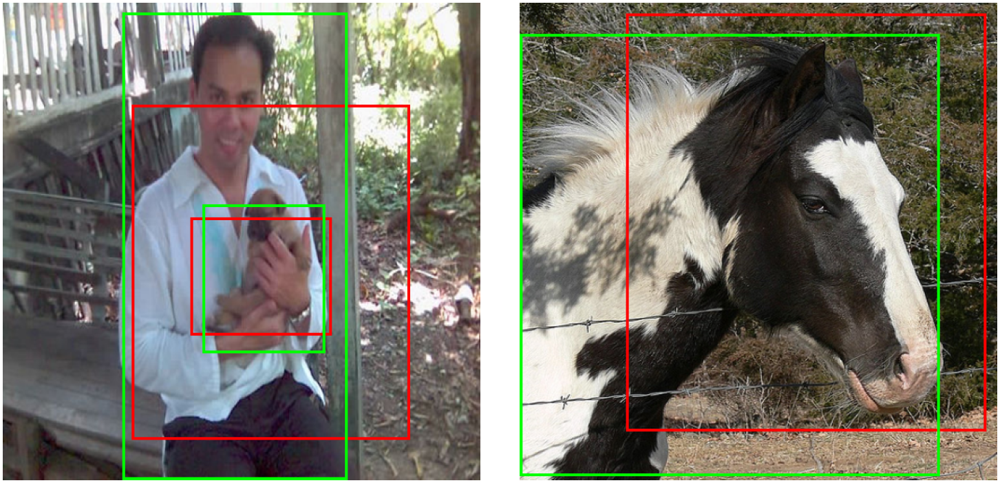

# LocalizationLabelNoise

This repository can be used to reproduce results of the CVPR 2023 SAIAD (Safe Artificial Intelligence for All Domains)
Workshop publication:
> **A Novel Benchmark for Refinement of Noisy Localization Labels in Autolabeled Datasets for Object Detection**
> [Andreas Bär](https://www.tu-braunschweig.de/ifn/institut/team/sv/baer), [Jonas Uhrig](https://scholar.google.de/citations?user=PmLbO_wAAAAJ&hl=en), [Jeethesh Pai Umesh](https://scholar.google.com/citations?user=ROv6rN4AAAAJ&hl=de), [Marius Cordts](https://scholar.google.de/citations?user=RM0ik8wAAAAJ&hl=en), [Tim Fingscheidt](https://www.tu-braunschweig.de/ifn/institut/abt/sv/prof-dr-ing-tim-fingscheidt).

The goal is to train a LLRN (localization label refinement network) that is capable of refining potentially badly
located 2D object bounding box labels (e.g. coming from autolabeling approaches). To this end we provide means to
reproduce all three main contributions: Generate artificially corrupted datasets, training and evaluating our 
proposed localization label refinement network (LLRN), as well as training and evaluating a state-of-the-art
2D object detector.

For more details, refer to the [paper](https://openaccess.thecvf.com/content/CVPR2023W/SAIAD/html/Bar_A_Novel_Benchmark_for_Localization_Label_Errors_and_Their_Refinement_CVPRW_2023_paper.html)


**Examples for our localization label refinement**. Our proposed framework takes a noisy localization label (red box) 
as input and outputs a refined localization label (green box).

## 📃 Content
- [LocalizationLabelNoise](#LocalizationLabelNoise)
  - [📃 Content](#-content)
  - [⚙️ Setup](#️-setup)
  - [📁 Generate and Analyze Noisy Dataset](#-Generate-and-Analyze-Noisy-Dataset)
  - [🔥 Localization Label Refinement Network (LLRN)](#-Localization-Label-Refinement-Network-(LLRN))
    - [LLRN Training](#-LLRN-Training)
    - [LLRN Evaluation](#-LLRN-Evaluation)
    - [Create Refined Dataset](#-Create-Refined-Dataset)
    - [Visualize Datasets](#-Visualize-Datasets)
  - [🏄 State-of-the-Art 2D Object Detector](#-State-of-the-Art-2D-Object-Detector)
    - [Train FasterRCNN with MMDetection](#-Train-FasterRCNN-with-MMDetection)
    - [Evaluate FasterRCNN with MMDetection](#-Evaluate-FasterRCNN-with-MMDetection)
  - [📜 License](#-license)
  - [🔗 Citation](#-citation)

## ⚙️ Setup
1. Initialize git submodules.

```bash
git submodule update --init --recursive
```

2. Make sure conda is installed.

```bash
conda --version
```

3. Install [mmdetection](https://github.com/open-mmlab/mmdetection) by following the [Installation instructions](https://mmdetection.readthedocs.io/en/v2.0.0/install.html):

- Create a conda virtual environment and activate it.

```bash
conda create -n open-mmlab python=3.10 -y
conda activate open-mmlab
```

- Install PyTorch and torchvision following the [official instructions](https://pytorch.org/) and make sure that the compilation cuda version and runtime CUDA version match. We pinned pytorch and CUDA to the following:

```bash
conda install pytorch==1.12.1 torchvision==0.13.1 torchaudio==0.12.1 cudatoolkit=11.3 -c pytorch
```

- Install mmdetection dependencies.

```bash
cd mmdetection/
pip install -r requirements/build.txt
pip install "git+https://github.com/cocodataset/cocoapi.git#subdirectory=PythonAPI"
```

- Install mmdetection.

```bash
pip install -v -e .
```

- Switch back to the root folder.

```bash
cd ..
```

4. Download [PascalVOC devkit](host.robots.ox.ac.uk/pascal/VOC/voc2012/#devkit).

- Download and extract the data file.

```bash
wget http://host.robots.ox.ac.uk/pascal/VOC/voc2012/VOCtrainval_11-May-2012.tar
tar -xf VOCtrainval_11-May-2012.tar
```

- Create an environment variable pointing to the data folder.

```bash
export PASCAL_VOC_ROOT=$(pwd)/VOCdevkit/VOC2012
```

5. Install LocalizationLabelNoise dependencies.

```bash
pip install -r requirements.txt
```
Note: for some machines, mmcv installation failed, but worked smoothly via following command:

```bash
pip install "mmcv>=2.0.0" -f https://download.openmmlab.com/mmcv/dist/cu116/torch1.12.0/index.html
```

6. Download the weights of the [ConvNeXt](https://github.com/facebookresearch/ConvNeXt) model, which serves as a backbone in our experiments.

```bash
mkdir model
wget -O model/convnext_tiny_22k_224.pth https://dl.fbaipublicfiles.com/convnext/convnext_tiny_22k_224.pth
```

**Note: All the scripts expect that the environment variable `PASCAL_VOC_ROOT` has been properly set during the installation step. Alternatively, you may provide the root path of the dataset using the command line parameter `pascal-voc-root`.**

## 📁 Generate and Analyze Noisy Dataset
Generate the LLRN training dataset and provide the desired noise percentage of modified bounding boxes as an integer, e.g. 30.

Example:

```bash
python generate_noisy_dataset.py 30
```

Analyze the average intersection-over-union (IoU) of the noisy dataset compared to the ground truth.
The script offers various ways to refer to the noisy dataset:

- Use the command line option `--box-error-percentage` and provide the noise percentage. The script construct the path to the noise labels assuming that the above command has been used to generate the noisy data.
- Use the command line option `--noisy-annotation-dir` and specify the directory of noisy annotations explicitly.

Example:

```bash
python analyze_noisy_dataset_iou.py --box-error-percentage 30
```

## 🔥 Localization Label Refinement Network (LLRN)
### LLRN Training
Training requires the weights of the ConvNeXt backbone, which are provided as a file using the `--weights` argument.
Our experiments are based on the ConvNeXt tiny model and its weights were retrieved during the installation step #6.
In case a different backbone such as [ConvNeXt base](https://dl.fbaipublicfiles.com/convnext/convnext_base_22k_224.pth) shall be used, you may need to adapt the depths and dims of the FasterRCNN model.

There are three model types available:

- single-pass: `--model-type single`
- multi-pass: `--model-type multi`
- cascade-pass: `--model-type cascade`

Run `python train_LLRN.py --help` to obtain the full set of available CLI parameters.

Example (single-pass):

```bash
python train_LLRN.py --model-type single --box-error-percentage 30
```

Example (multi-pass):

```bash
python train_LLRN.py --model-type multi --num-stages 3 --box-error-percentage 30
```

### LLRN Evaluation
Running the LLRN evaluation requires

- generating the noisy dataset as described above
- training the LLRN model as described above

The evaluation script expects the same command line arguments as the training script.
There is an additional option `--visualize-every-kth-batch` to visualize one output of a batch.
For visuzalizing the entire validation set predictions, use `--batch-size 1` and `--visualize-every-kth-batch 1`.

Example (single-pass):

```bash
python eval_LLRN.py output/single<settings>/<epoch>_val_loss_<val_loss>.pth --model-type single --box-error-percentage 30 --visualize-every-kth-batch 1
```

### Create Refined Dataset
Having trained LLRN, it may be used to create the refinded dataset.
For detailed information on the required command line arguments, please refer to the above section on evaluation.
Use the `--description <some-description>` command line option to distinguish between different refinded datasets.

Example (single-pass):

```bash
python generate_refined_dataset.py <path_to_model_checkpoint>.pth --model-type single --box-error-percentage 30 --description some-refined-dataset
```

### Visualize Datasets
To visualize the ground truth, the noisy or the refined annotations, use the following script:

```bash
python visualize_dataset.py [--visualize-gt] [--visualize-noisy-labels] [--visualize-training-data] [--visualize-refined-labels --refined-labels-dir Refined_box_corruption_30_single1_default]
```

## 🏄 State-of-the-Art 2D Object Detector
### Train FasterRCNN with MMDetection
To train the SOTA object detector based on ConvNext and Faster RCNN in mmdetection v3.0.0, use the following command. 
As shown below, you can easily specify which annotation subdirectory shall be used, i.e. the default 'Annotations' or
a corrupted version such as 'Annotations_box_corruption_30' or a LLRN-refined version such as 
'Refined_box_corruption_30_single1_default' via '--cfg-options train_dataloader.dataset.ann_subdir'. If your machine 
has multiple GPUs, you can specify the GPU ID via 'export CUDA_VISIBLE_DEVICES=<ID>'. For the publication, we 
trained on a single GPU with batch-size of 4 using mmdetection v2.25.0 (but batch size of 2 as well as mmdetection 
v3.0.0 worked similarly well).

```bash
python mmdetection/tools/train.py configs/faster_rcnn/faster_rcnn_ConvNext_CustomNeck_VOC.py --work-dir /<desired_output_dir>/ --cfg-options train_dataloader.dataset.ann_subdir=<desired_annotations_dir, e.g. Annotations_box_corruption_30>
```

### Evaluate FasterRCNN with MMDetection
Besides the regular evaluation during the training (typically 1 eval every epoch, computing mAP for IoU thresholds
of 0.5, 0.6, 0.7, 0.8, 0.9), you can also trigger a dedicated evaluation of a certain checkpoint with the following
command:
```bash
python mmdetection/tools/test.py configs/faster_rcnn/faster_rcnn_ConvNext_CustomNeck_VOC.py <path_to_above_work_dir>/epoch_<xx>.pth
```

## 📜 License
This project is licensed under MIT license. Please see the [LICENSE](LICENSE) file for more information.

```yaml
SPDX-License-Identifier: MIT
```

## 🔗 Citation
```
@InProceedings{Bar_2023_CVPR,
    author    = {B\"ar, Andreas and Uhrig, Jonas and Umesh, Jeethesh Pai and Cordts, Marius and Fingscheidt, Tim},
    title     = {A Novel Benchmark for Localization Label Errors and Their Refinement in Autolabeled Datasets for Object Detection},
    booktitle = {Proceedings of the IEEE/CVF Conference on Computer Vision and Pattern Recognition (CVPR) Workshops},
    month     = {June},
    year      = {2023},
    pages     = {3850-3859}
}
```
